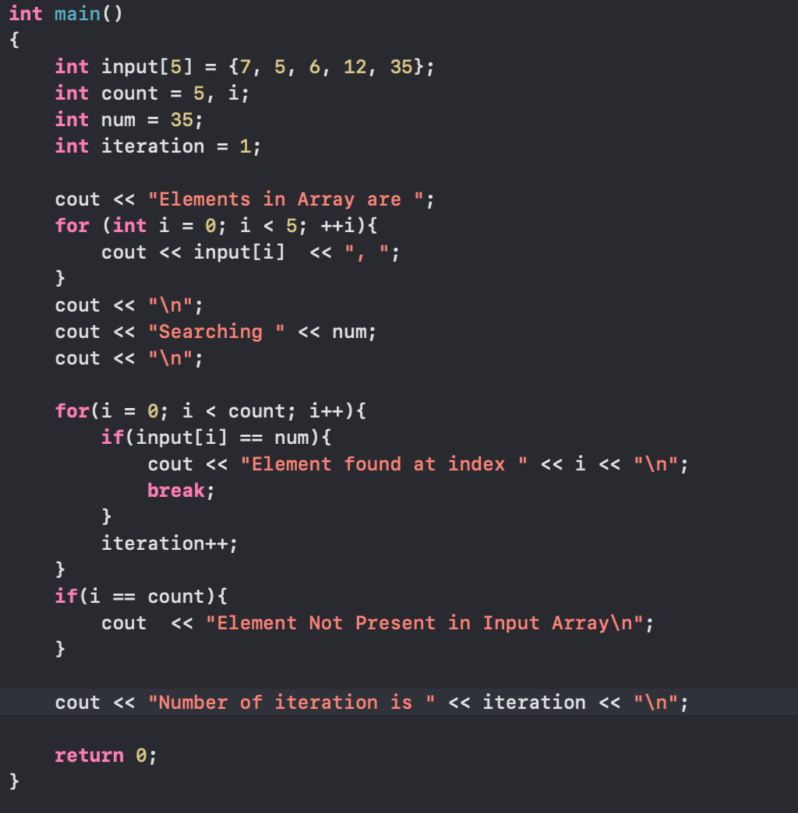
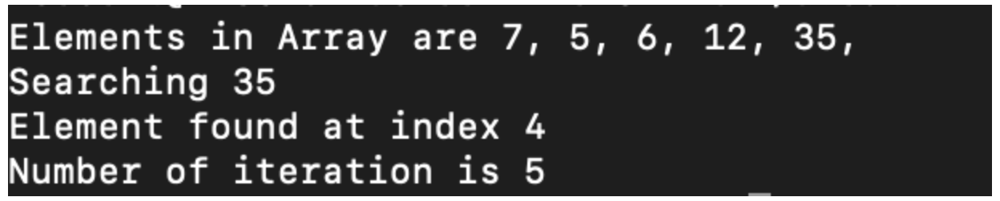
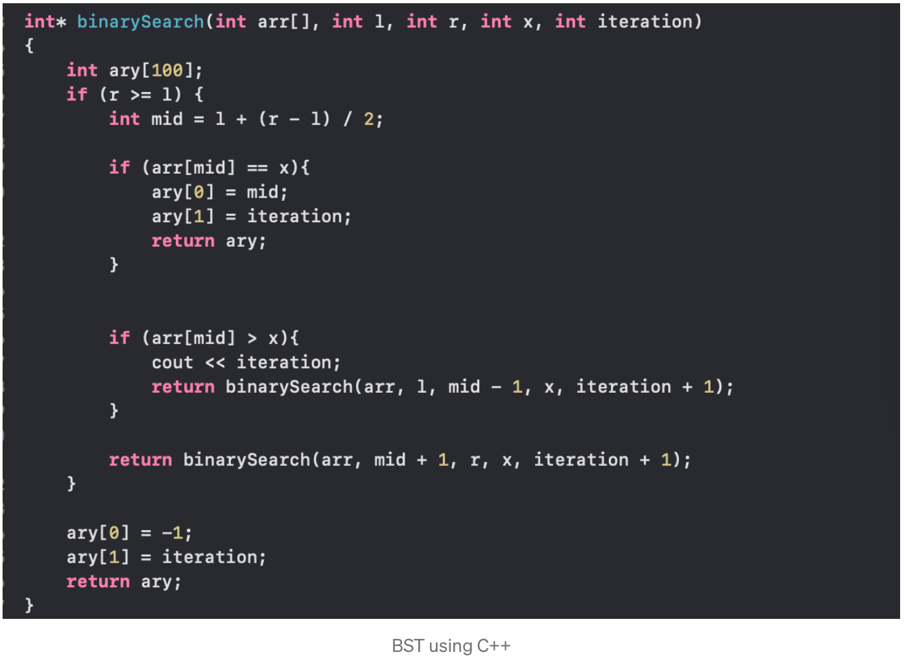
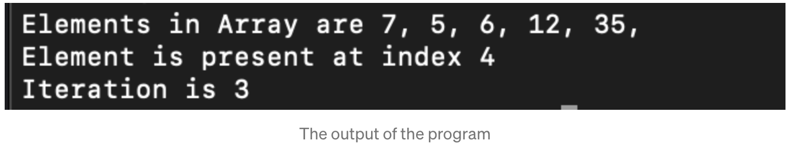

# Data Structure

You might hear the term Data Structure everywhere if you are from the computer science field.

## What is Data Structure?
If you notice something the term **Data Structure** itself says what it means. Let's break the term **Data and Structure**.
*Data* means a collection of some information it can be of anything eg. a list of numbers, or a bunch of user information or else any bunch information it can be.
*Structure* means building or else to be simple we can say organize.
So, combining **Data Structure** is actually organizing a bunch of data in such a way that it can be used more efficiently with respect to time and memory.

###### *Let's understand with a simple example*
Consider you have a list of integer numbers and you want to search for a number in the list. Unfortunately, if the number is at the end of the list, of course, the iteration will be increased, right?

Using Linear Search you can clearly see that the number check with each number in the array. In case the number is at the end of the list your iteration will be increased.

Whereas using Binary Search Tree your iteration will be decreased based on the BST algorithm and compared to Linear Search you can use BST because it will be much more efficient if the number is at the end but this efficiency will be lacking in BST if the searching number is at the start of the list.
**NOTE: This BST will work only if the list is sorted in ascending order.**

The Iteration is 3 for searching the number 35.

*To be very much clear Data Structure is not a Programming Language it is a set of algorithms and the Algorithm is nothing but a set of instructions to complete a specific task.*

### Types of Data Structure
#### 1. Simple Data Structure
Simple Data Structure is built from primitive data types like int, float, string, char, etc.
Example: An array is also a simple data structure that holds the same or different data types.
#### 2. Compound Data Structure
Combining two or more simple data structures is Compound Data Structure.
Compound DS is further classified into 2 categories:
**a. Linear Data Structure:**
Elements in the data structure are ordered in sequence then it is Linear DS. Example: Stacks, Queue, Linked List.
**a. Non-Linear Data Structure:**
Elements in the data structure are not ordered in sequence then it is Non-Linear DS. These are multilevel DS. Example: Tree, Graphs, etc.
#### 3. Static and Dynamic Data Structures
In Static DS, the size of the structure is fixed. the data in the structure can be modified but the size of the structure cannot be modified.
In a Dynamic DS, the size of the structure is not fixed and can be modified during the operations performed on it.

## Operations on Data Structure
**Insertion:** Adding a new element into the data structure.
**Searching:** Searching a specific element in the data structure.
**Sorting:** This operation is about arranging all the elements in the data structure either in ascending or descending order.
**Merging:** This operation is about combining similar elements from two or more data structures.
**Deletion:** This operation is about deleting or removing an existing element from the data structure.
**Traversal:** This operation is about processing and displaying all the elements in the data structure.