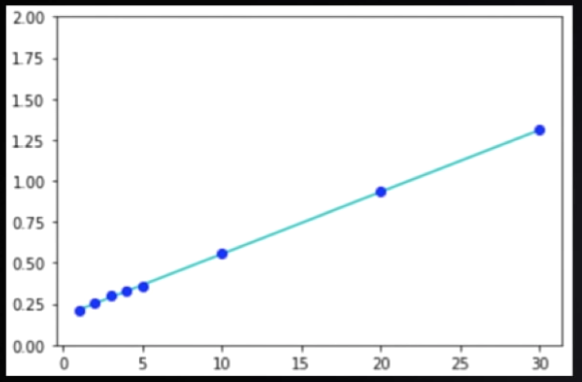
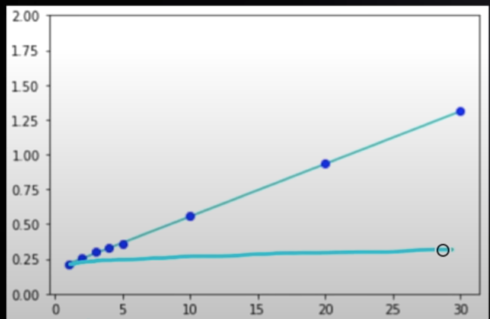
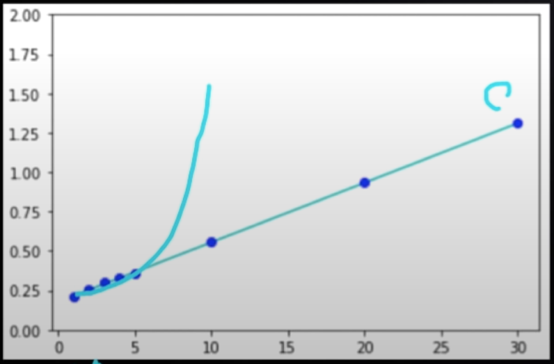

## Time Complexity
The time which is required to complete a task based on the algo provided is called time complexity.

##### Different type of time complexity
* Execution of the task also depends on the speed of your computer.
* There are three main types of **Time Complexity**
    * Linear Time
    * Constant Time
    * Quadratic Time
  
* **Linear Time**
  * It has a linear graduation of the time based on the Input Size.
  * 
  * Linear Time can be expressed as O(n) where *n* is the size of the input
  * How O(n)?
    * Linear eqtn is expressed as T = an + b  where *n* is the size of the input
    * we need to find the fastest growing term in *an + b*
    * Here *an* is the longest term because its value will be changed based on the input size.
    * Now remove the coefficient and we get O(n).
* **Constant Time**
  * It has a constant output irrespective of the increased input size.
  * 
  * Constant Time can be expressed as O(1) where *n* is the size of the input
  * How O(1)?
    * Constant eqtn is expressed as T = b  where *b* is the constant of the time.
    * Here *b* is the constant value.
    * Now we can say T = b * 1 which is noting but T = O(1) we can change the 1 value to 2, 3 or anything but  for everyone's convention we use 1.
* **Quadratic Time**
  * It has a drastic change in executing a task by slightly increasing the input size.
  * 
  * Quadratic Time is expressed as O(n²) where *n* is the size of the input
  * How O(n²)?
    * we need to find the fastest growing term in *an² + bn + c*
    * Here *an²* is the longest term because its value will be changed based on the input size.
    * Now remove the coefficient and we get O(n² ).
  
## How to Check Time Complexity of your program.
Let's check an example of O(1).

```python
    def some_function(array):
        sum = 1 + 2 #O(1)
        return sum  #O(1)
```
Here, the sum variable does not depends on the array for executing the code. So we can say it's time is constant and it's time complexity is O(1).
c1 = O(1) *- (sum = 1 + 2)*
c2 = O(1) *- return sum*
T = c1 + c2 *T is Time Complexity*
c1 + c2 = c3
**T = c3 * 1 = O(1)**
and in general **O(1) + O(1) = O(1)**

Now let's see an example of O(n).

```python
    def some_function(array):
        total = 0           # O(1)
        for no in array:    
            total += no     # O(1)
        return total        # O(1)
```
Note: Here, *total += no* this is constant i.e O(1) but the loop which we are running depends on the size of the array let say **n**. So our final time complexity eqn looks like
T = O(1) + n * O(1) + O(1)
T  = c1 + n * c5 + O(1)
Now we need to take fastest growing term and remove the coefficient
Which becomes **T = O(n)**

Example of O(logn).
* Most recursive function is said to be an example of log n.

```python
  def logn(n):
    while (n > 1):
      value = n // 2
    return value
```
<center><b>Or</b></center>

```python
  def logn(n):
    if n == 0 return "Done"
    value = n // 2
    return logn(value)
```

Here the recursion of a task occurs based on some condition.
So this is an example of O(log n).
